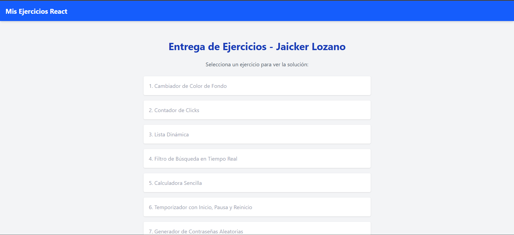

# ⚛️ Entrega de Ejercicios React - Máster Full Stack

Este repositorio contiene la solución a la serie de ejercicios prácticos de ReactJS desarrollados para el Máster en Desarrollo Full Stack de la academia **Conquer Blocks**.

El objetivo principal es demostrar el dominio de los fundamentos de React, Hooks, manejo de estado, enrutamiento y persistencia de datos.

## 🚀 Demo en Vivo

Puedes ver el proyecto funcionando aquí:
👉 **[Ver Despliegue en GitHub Pages](https://jaickerlozano.github.io/entrega-react/)**


---

## 🛠️ Tecnologías Utilizadas

* **React JS** (Vite): Librería principal de UI.
* **Tailwind CSS**: Para el estilizado rápido y responsivo.
* **React Router DOM**: Para la navegación (SPA) entre los ejercicios.
* **LocalStorage**: Para la persistencia de datos en el navegador.
* **JavaScript (ES6+)**: Lógica de programación.

---

## 📋 Lista de Ejercicios

La aplicación consta de una Landing Page que conecta con 9 ejercicios independientes:

1.  **🎨 Cambiador de Color de Fondo:** Uso básico de `useState` y estilos en línea dinámicos.
2.  **🖱️ Contador de Clics:** Manejo de eventos y actualización de estado basado en el valor previo.
3.  **📝 Lista Dinámica:** Manipulación de arrays (CRUD básico) en el estado.
4.  **🔍 Filtro de Búsqueda:** Filtrado de arrays en tiempo real (Estado derivado).
5.  **🧮 Calculadora Sencilla:** Lógica matemática, validaciones y manejo de errores.
6.  **⏱️ Temporizador:** Uso avanzado de `useEffect` y `setInterval` para cronómetros controlables.
7.  **🔐 Generador de Contraseñas:** Manipulación de Strings, `Math.random` y validación de formularios.
8.  **abcd Contador de Palabras:** Uso de Expresiones Regulares (Regex) para análisis de texto.
9.  **✅ Lista de Tareas (To-Do) con Persistencia:** Aplicación completa con objetos, checkboxes individuales y `localStorage`.

---

## 💻 Instalación y Ejecución Local

Si deseas correr este proyecto en tu máquina local:

1.  **Clonar el repositorio:**
    ```bash
    git clone [https://github.com/jaickerlozano/entrega-react.git](https://github.com/jaickerlozano/entrega-react.git)
    ```

2.  **Instalar dependencias:**
    ```bash
    cd entrega-react
    npm install
    ```

3.  **Correr el servidor de desarrollo:**
    ```bash
    npm run dev
    ```

---

## 👤 Autor

**Jaicker Lozano**
* Ingeniero de Procesos & Desarrollador Frontend en formación.
* [Perfil de GitHub](https://github.com/jaickerlozano)
* [Perfil de LinkedIn](https://www.linkedin.com/in/jaicker-rafael-lozano-flores-970197264/)

---
*Desarrollado con 💙 durante el Máster de Conquer Blocks.*
